<!-- Matrix-Style Header Animation -->
<div align="center">
  
</div>

<!-- Animated Banner -->
<p align="center">
  
</p>

<!-- Animated Profile Badges -->
<div align="center">
  
  
  
  
  
</div>

<!-- Quick Social Links -->
<div align="center">
  
  [](https://know-meee.vercel.app/)
  [](https://www.linkedin.com/in/webdevelopersakshigupta/)
  [](mailto:sakshisatya2311@gmail.com)
  [](https://github.com/thesakshigupta)
  
</div>

<!-- Animated Line Divider -->


<!-- Terminal-Style About Section -->
##  &nbsp;`$ cat about_me.md`

<table>
<tr>
<td width="55%" valign="top">

```js
/**
 * @developer Sakshi Gupta
 * @description Frontend Developer crafting the web
 * @version 2024.01
 */
 
class Developer {
    constructor() {
        this.name = "Sakshi Gupta";
        this.role = "Frontend Developer";
        this.location = "India 🇮🇳";
        this.languages = ["JavaScript", "Python", "Java"];
        this.hobbies = ["Coding","Problem Solving", "Learning"];
    }
    
    get currentStatus() {
        return {
            learning: ["Next.js", "TypeScript", "Backend"],
            working_on: "Building beautiful web experiences",
            looking_for: "Open source collaborations",
            fun_fact: "I debug with console.log() 🐛"
        };
    }
    
    sayHi() {
        console.log("Thanks for dropping by! Let's connect 🚀");
    }
}

const sakshi = new Developer();
sakshi.sayHi();
```

</td>
<td width="45%" valign="top">


### 🎯 Quick Facts

- 🔭 Building **[know-meee.vercel.app](https://know-meee.vercel.app/)**
- 🌱 Learning **Next.js, TypeScript & Three.js**
- 💬 Ask me about **React, JavaScript, CSS**
- 📫 Reach me at **sakshisatya2311@gmail.com**
- ⚡ Fun Fact: **Night owl coder 🦉**

### 🏆 Achievements

- 🎓 Diploma from **BIT Mesra** with **8.28 CGPA**
- 💼 Interned at **Jharkhand Govt Tool Room**
- 🌟 B.Tech CSE at **JBIT, MDU Rohtak**

</td>
</tr>
</table>


<!-- Real-time Clock & Status -->
##  &nbsp;`$ systemctl status developer`

<div align="center">

<!-- Dynamic Status Cards -->
<a href="https://github.com/thesakshigupta">
  
</a>

</div>

<!-- Coding Activity Section -->
<div align="center">
  
  
  
  
</div>


<!-- Arsenal Section (Tech Stack) -->
##  &nbsp;`$ ls -la ~/tech-stack/`

<!-- Primary Weapons -->
<details open>
<summary><b>⚔️ Primary Weapons (Frontend)</b></summary>
<br/>
<p align="center">
  <a href="https://skillicons.dev">
    
  </a>
</p>

<div align="center">
  
| Technology | Experience Level | Projects |
|:---:|:---:|:---:|
|  React.js | ████████████░░ 90% | 10+ |
|  Next.js | ██████████░░░░ 75% | 5+ |
|  JavaScript | █████████████░ 95% | 15+ |
|  Tailwind | ███████████░░░ 85% | 8+ |

</div>
</details>

<!-- Secondary Weapons -->
<details open>
<summary><b>🗡️ Secondary Weapons (Languages)</b></summary>
<br/>
<p align="center">
  <a href="https://skillicons.dev">
    
  </a>
</p>
</details>

<!-- Utility Belt -->
<details open>
<summary><b>🛠️ Utility Belt (Tools & Platforms)</b></summary>
<br/>
<p align="center">
  <a href="https://skillicons.dev">
    
  </a>
</p>
</details>

<!-- Currently Learning -->
<details>
<summary><b>📚 Currently Learning (XP Grinding)</b></summary>
<br/>
<p align="center">
  <a href="https://skillicons.dev">
    
  </a>
</p>
</details>


<!-- GitHub Stats Section -->
##  &nbsp;`$ git log --oneline --graph`

<!-- GitHub Activity Graph -->
<p align="center">
  
</p>

<!-- Stats Row 1 -->
<div align="center">
  
  
</div>

<!-- Stats Row 2 -->
<div align="center">
  
</div>

<!-- GitHub Metrics -->
<div align="center">
  
</div>

<div align="center">
  
  
  
</div>


<!-- GitHub Trophies -->
##  &nbsp;`$ cat achievements.log`

<div align="center">
  
</div>

<br/>

<!-- Achievement Badges -->
<div align="center">
  
  
  
  
</div>


<!-- Featured Projects -->
##  &nbsp;`$ tree ~/projects/`

<div align="center">

<table>
<tr>
<td width="50%">

### 🎯 React Dashboard
<p align="center">
  <a href="https://github.com/thesakshigupta/react-dashboard">
    
  </a>
</p>


<p align="center">
  
  
  
</p>

</td>
<td width="50%">

### ✨ Portfolio Website
<p align="center">
  <a href="https://github.com/thesakshigupta/know-me">
    
  </a>
</p>


<p align="center">
  
  
  
</p>

</td>
</tr>
</table>

<br/>

<a href="https://github.com/thesakshigupta?tab=repositories">
  
</a>

</div>


<!-- Experience Timeline -->
##  &nbsp;`$ history | grep experience`



<br/>

<!-- Education Cards -->
<div align="center">

```mermaid
timeline
    title 🚀 My Developer Journey
    
    2021 : Started Diploma at BIT Mesra
         : First line of code
         : Fell in love with coding
    
    2022 : Learned HTML, CSS, JavaScript
         : Built first web projects
         : Workshop on IoT & Robotics
    
    2023 : Learned more about web development
         : Internship at Jharkhand Govt Tool Room
         : Built IoT prototypes
    
    2024 : Graduated with 8.28 CGPA
         : Started B.Tech CSE
         : Building production apps
    
    2025 : Learning Full Stack development
         : Contributing to open source
         : AI + Web Development
```

| 🎓 Degree | 🏛️ Institution | 📅 Duration | 📊 Score |
|:---|:---|:---:|:---:|
| **B.Tech CSE** | JBIT, MDU Rohtak | 2024 - Present | *Pursuing* |
| **Diploma Computer Engg** | BIT Mesra, Ranchi | 2021 - 2024 | **8.28 CGPA** ⭐ |
| **10th Standard** | Stronnat High School | 2020 - 2021 | **85.40%** 🏆 |

</div>


<!-- Dev Quote -->
##  &nbsp;`$ fortune | cowsay`

<div align="center">
  
</div>

<br/>

<!-- ASCII Art -->
```
    ╔══════════════════════════════════════════════════════════════╗
    ║                                                              ║
    ║     "First, solve the problem. Then, write the code."        ║
    ║                                        - John Johnson         ║
    ║                                                              ║
    ╚══════════════════════════════════════════════════════════════╝
```


<!-- Connect Section -->
##  &nbsp;`$ ping sakshi`

<div align="center">

### 🤝 Let's Build Something Amazing Together!

<p>I'm always open to interesting conversations and collaboration opportunities!</p>

<br/>

<!-- Animated Connect Buttons -->
<a href="https://www.linkedin.com/in/webdevelopersakshigupta/">
  
</a>
<a href="mailto:sakshisatya2311@gmail.com">
  
</a>
<a href="https://know-meee.vercel.app/">
  
</a>
<a href="https://github.com/thesakshigupta">
  
</a>

<br/><br/>

<!-- Contribution Snake Animation -->
<picture>
  <source media="(prefers-color-scheme: dark)" srcset="https://raw.githubusercontent.com/platane/platane/output/github-contribution-grid-snake-dark.svg"/>
  <source media="(prefers-color-scheme: light)" srcset="https://raw.githubusercontent.com/platane/platane/output/github-contribution-grid-snake.svg"/>
  
</picture>

</div>


<!-- Support & Sponsor -->
<div align="center">
  
### 💜 Show Some Love!

<p>If you like my work, consider starring ⭐ my repos or following me!</p>

<a href="https://github.com/thesakshigupta?tab=repositories">
  
</a>

</div>


<!-- Visitor Counter -->
<div align="center">
  <br/>
  
  <br/>
  <sub>👁️ You are visitor #</sub>
</div>

<!-- Footer -->
<div align="center">
  
</div>

<!-- Hidden Message for Fellow Developers -->
<!--
    ╔═══════════════════════════════════════════════════╗
    ║                                                   ║
    ║   👋 Hey fellow developer!                         ║
    ║                                                   ║
    ║   If you're reading this, you're awesome!         ║
    ║   Feel free to fork this README and make it       ║
    ║   your own. Happy coding! 🚀                       ║
    ║                                                   ║
    ║   - Sakshi                                        ║
    ║                                                   ║
    ╚═══════════════════════════════════════════════════╝
-->

---

<div align="center">
  <sub>✨ Crafted with 💜 & ☕ by <a href="https://github.com/thesakshigupta">Sakshi Gupta</a> | © 2024</sub>
  <br/>
  <sub>🎨 Design inspired by the amazing GitHub community</sub>
</div>
